# rea-enhancement

Tampermonkey userscript that adds what [realestate.com.au](https://www.realestate.com.au/) rental search is missing: an **available-from** date filter, sort by availability, every results page merged into one list, extra filters, on-card availability badges, a shortlist, and CSV export.

REA has an `availableBefore=` ceiling but no floor, no availability sort and no cross-page view. The data is already in every results page (the SSR hydration blob, `window.ArgonautExchange`), so the script reads it and does the rest in your browser.

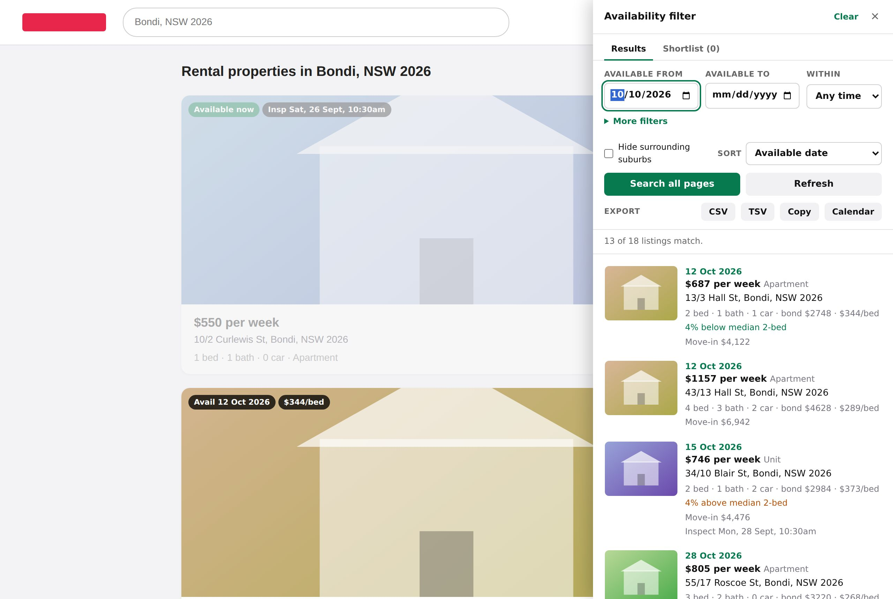

Everything stays local: no account, no telemetry, no third-party requests. The only network traffic is to realestate.com.au, the same pages you'd load by clicking through the results yourself.

## Install

1. Install [Tampermonkey](https://www.tampermonkey.net/) in Chrome (Firefox/Edge also work).
2. Click **[install the script](https://raw.githubusercontent.com/cpwillis-pocs/rea-enhancement/main/rea-availability-filter.user.js)**. Tampermonkey opens its install page; confirm.
3. Open any `realestate.com.au/rent/...` search and click **Availability Filter** at the bottom right.

Updates are automatic: Tampermonkey checks `@updateURL` (the file on `main`) and installs any newer `@version`. To update now, Tampermonkey dashboard -> **Utilities** -> **Check for userscript updates**.

## Features

**Filter and sort across every page**
- Available from / to, or a rolling window (within 2/4/8/12 weeks) that stays current as a saved setting. Handles "Available now", `12 Oct 2026`, `Mon 12th Oct` (year inferred), `October 12`, `1st of December`, `12/10/2026`. Past dates count as available now.
- Weekly rent min/max (monthly and annual rents converted to weekly), max move-in cost, max **cash to move** (move-in plus any rent paid twice while your lease overlaps), min beds/baths/cars, **min floor size** (m² from REA's details or the listing text; land and balcony sizes are skipped), property type (pick several, eg Apartment and Unit), photo required, inspection on a given day, listed over 3 weeks ago.
- Keywords over headline, description, address and features: `pool|balcony -studio "north facing"` (`a|b` is either; accents are ignored).
- **Amenities**: pets, furnished, air con, dishwasher, own laundry, outdoor space, built-in robes, pool, study, ensuite, heating, gas cooking, lift, secure parking, solar, NBN fibre, EV charging, step-free, water efficient. Tags carry detail where the text gives it: "Pets welcome" vs "Pets on application", "Heating: ducted". Click a chip to require it, again to exclude it. Read from REA's feature list and the description ("no pets" counts as no); unknown never counts as yes.
- **Other places**: up to 3 named points (work, school, partner) with km to each and a "Nearest to all places" sort.
- **Distance** from any point: paste coordinates or a Google Maps link (right-click a spot, copy the numbers). Shows km on every listing, filters by max km, sorts nearest first. Straight-line distance, no lookups.
- **Hide an agency** you've ruled out (undo, or unhide later); photo count and "Has a floorplan" filter.
- Sort (⇅ reverses it; listings without the value stay last) by available date, price, price per bed, price per m², least cash to move, best value vs median, **best match**, nearest, most beds, next inspection, newest first. Best match is a 0-100 score from rent vs your budget (or the median), timing vs your "from" date, distance and move-in cost, weighted as you choose in Settings; hover it to see the parts.
- **Move-in cost** (bond + 2 weeks' rent) on every listing; bonds above 4 weeks' rent are flagged.
- **Lease overlap**: with your current lease end set, each listing shows the days of double rent (and cost) or the nights you'd need to cover, sortable.
- **Lease term**, **Apply via** portal and **applications-close date** ("Apply by Fri 3 Oct") picked out of the text, with a Needs action nudge on your shortlist within 3 days of the deadline; filter out leases shorter than you need; availability read from the description when REA's date is missing.
- **Same building**: see other units in the building, spot the same place listed twice, or keep one listing per building.
- **Rent vs median** for the same bed count in your results (eg "12% below 2-bed median"); when a search spans several suburbs, each listing is compared with its own suburb ("at median for Maroubra 2-bed").
- **Taken listings**: "Deposit taken", "Under application" or "Leased" in the listing text is tagged in the drawer and on REA's cards; **Hide listings already taken** filters them out.
- **Market view**: rent spread per bed count, per-agency patterns (rent drops, relists, taken-but-listed, days listed; counts, not ratings) and a week-by-week availability chart for what you're looking at; click a week to filter to it.
- **Map view** (v): the listings shown on a simple map (no map tiles), coloured by rent vs the median, with your places as pins; click a dot to jump to the listing.
- **Why this tag?** Hover an amenity or heads-up tag for the sentence it was read from; with a keyword filter, each listing says where it matched.
- **Heads-up tags**: short lease, water charged, fees, "offers above" wording, strata approval, lease-break terms, a required professional clean, rent payment fees, garden/pool upkeep, and noise (a busy road, shops or a bar below, a rail line, a flight path, construction nearby, when said of the home itself), picked out of the listing text; **Hide if mentioned** filters them out.
- **Household income** (optional): rent as a share of income, flagged over 30%.
- **Active filter chips** show what's filtering and how many listings each removes; click one to drop it.
- **Presets**: save filter sets by name, or one per search that applies automatically when you come back.
- **Bulk actions** (shortlist or hide everything shown, set a status across the shortlist) with Undo.
- **Expand** (⤢ in the drawer's header, or e): near full screen, with the filters in a left column and results in a grid of cards; remembered until you shrink it again. Or drag the drawer's left edge to any width (two results per row from 760px).
- **Compact list** (Settings, or d): small photos and the key facts, about twice as many listings on screen.
- **Back where you were**: reload the page or come back to the search and the drawer opens on the listing you were on (same filters and sort); the Shortlist tab does the same.
- **Photo peek**: p or Space (or hover a thumbnail) shows a large photo; j/k flip through listings with it open.
- **Reviewed**: going past a listing with j, pressing r, or shortlisting, hiding or noting it marks it reviewed; **Not reviewed yet** (More filters) and "reviewed 34 of 150" in the status line keep your place across visits.
- **Hidden for the price?** Give "price" as the reason and the listing comes back, tagged "$110 cheaper since you hid it", if its rent drops. Reasons can be set or changed later from a hidden listing's ⋯ menu.
- **Inspections I can make**: keep only listings with an open home on a weekend, after 5pm, or at **your own times** (type days and hours, eg `Sat 9-13, Sun, weekdays 17:30-`; read in the listing's time zone).
- **Keyboard**: j/k move, g/G or Home/End first/last, PgUp/PgDn by 5, s shortlist, h hide, u undo, n note, c copy summary, r reviewed, p photo, x tick for Compare, 1–5 application status, Shift+1–5 your rating, o or Enter open, t Results/Shortlist, m market view, v map, f filters, d compact, e expand, / keywords, ? help, Esc close; Alt+Shift+F toggles the drawer.
- Walks every results page of the current search (max 20), dedupes, and says when a search is too broad to read fully.

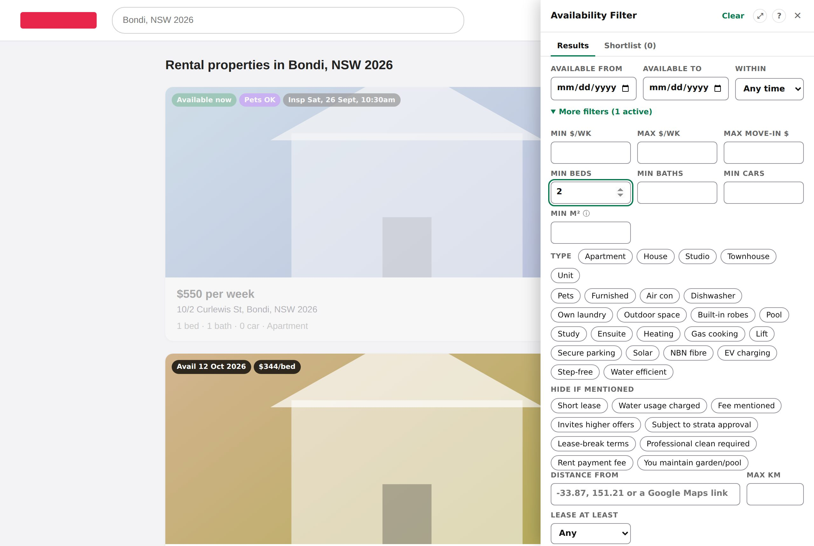

**On REA's own result cards**
- Badges: availability, next inspection, $/bed, distance, pets, shortlisted, new, price changed.
- **Star** and **Hide** buttons right on each card.
- Cards that don't match your filters fade out; hover to bring one back.

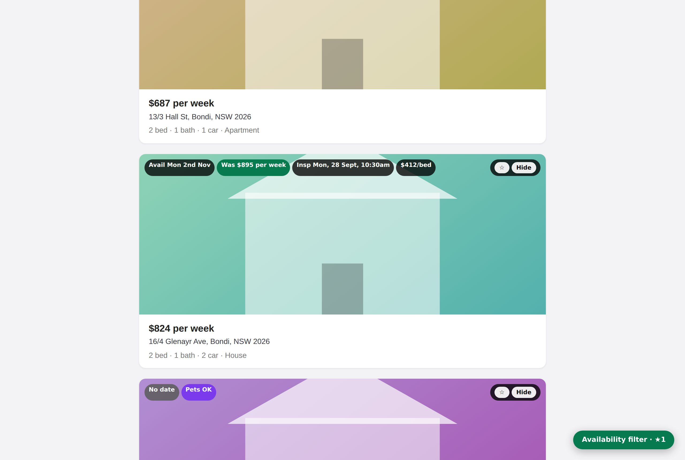

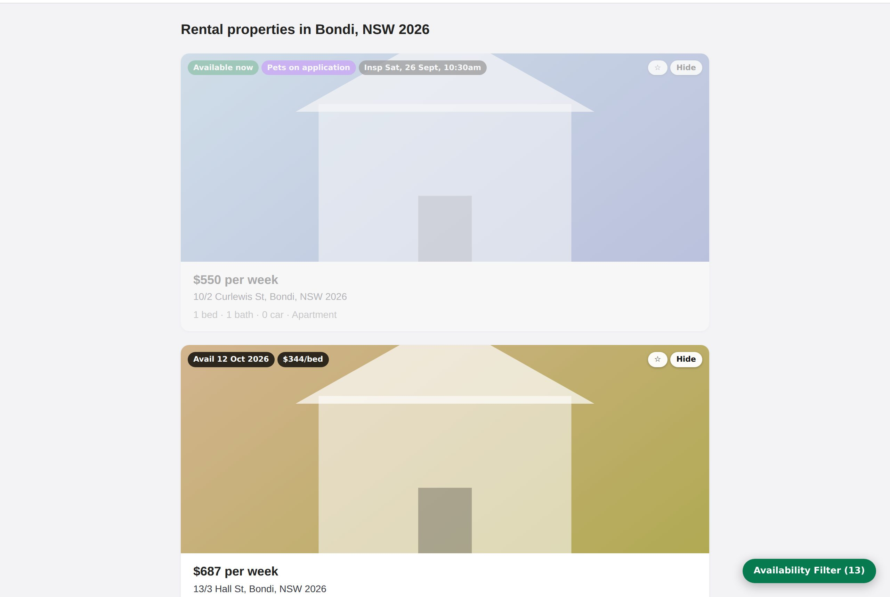

**Shortlist, hide, new, price changes**
- Star a listing to shortlist it, or hide one you've ruled out. Both persist in your browser.
- The **Shortlist** tab collects starred listings from every search you've run, with a private note and an **application status** (to inspect, inspected, applied, approved, declined) per listing; search it, filter by status and export it.
- **Compare** up to 6 shortlisted listings side by side, best value per row highlighted.
- **Your rating** (1–5, or Shift+1–5) per shortlisted listing, shown in Compare and exports.
- **Inspection checklist** per shortlisted listing (damp, water pressure, signal, light, noise, storage, or your own), shown in Compare and on the printout.
- **Plan an inspection day**: shortlisted inspections in order with clashes and tight travel gaps flagged, plus a **suggested route** that fits in as many listings as can be reached in time (one session each, "to inspect" ones first), exportable to your calendar as the whole day or just the route. Declined, taken and removed listings are left out; with your own inspection times set, sessions outside them are marked and not routed.
- **Re-check** shortlisted listings to refresh price, availability and inspections from their pages, and spot ones taken down.
- **Share** the shortlist as a link or **Print** it for open homes. The shared data sits in the link's `#` fragment, which browsers don't send to REA's servers; REA's own page scripts could read it before the script clears it, and wherever you paste the link keeps a copy.
- **Backup / Restore** the shortlist, hidden listings, notes, remembered searches and your settings as a JSON file, eg to move to another browser. Settings shows when you last backed up; a restore says what it will change first and can be undone. A **safety copy** in the browser's IndexedDB is offered back if this site's storage gets wiped.
- **Remembers each search between visits** (on by default; a setting turns it off and forgets what's stored). Coming back shows the saved results straight away, and **Refresh** fetches current listings and diffs them: listings added since your last visit are tagged **new** (filter: "New since last visit only"), and ones taken down are counted and can be shown greyed out. Sort **Newest first** to see additions in order of listing.
- **Saved searches**: see your remembered searches (with a rent trend across visits) and **Check all for new listings** in one click (each fetched one page at a time), with an optional once-a-day reminder. **Pin** a search to keep it when you open others (3 are remembered); you're told when one is forgotten.
- **Opened tracking**: "opened 2d ago" on listings you've looked at, and a **Not opened yet** filter.
- **Hide with a reason** (too small, location, condition, price) so you remember why later.
- **Application follow-up**: "did you inspect?" after an inspection passes, time since you applied, a "follow up?" nudge, a **Needs action** filter, and your record with each agency.
- **Copy enquiry**: a ready-made message for the agent from a template you can edit.
- **On a listing page**, a small bar lets you shortlist, set status, note or hide that listing directly; for a shortlisted one it also has your inspection checklist, your rating, the key facts and the **next stop** (the next shortlisted inspection today, how far, when to leave).
- Price changes show "was $X" (hover for the full history). Availability date changes show the same way, and **Price or date changed recently** filters to them. A listing relisted at the same address under a new id is tagged **relisted** with its old price, and stays hidden if you'd hidden it.

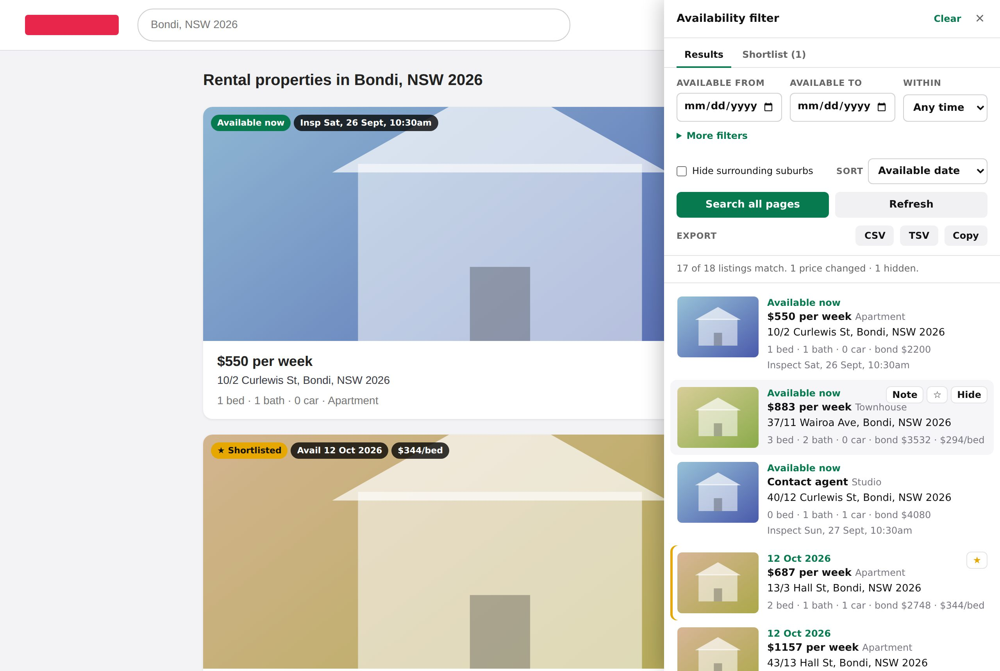

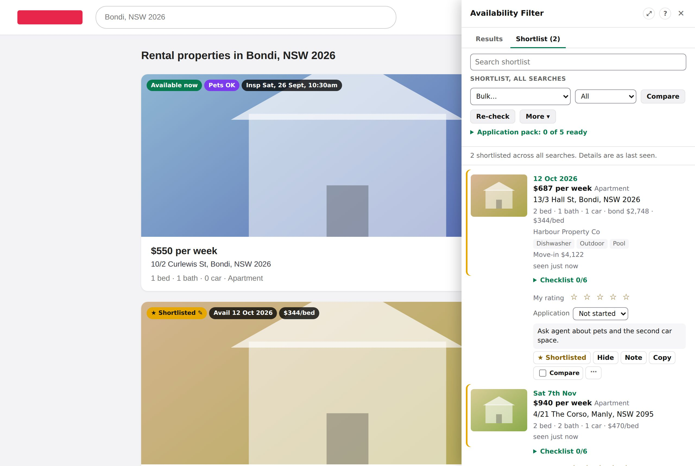

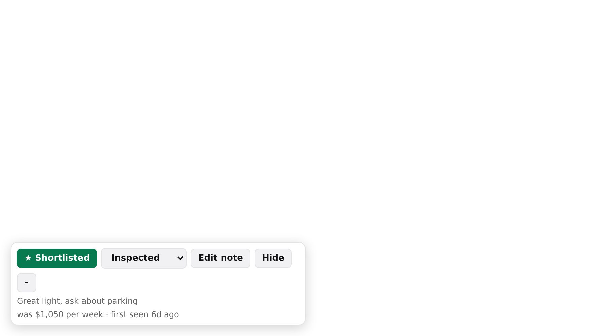

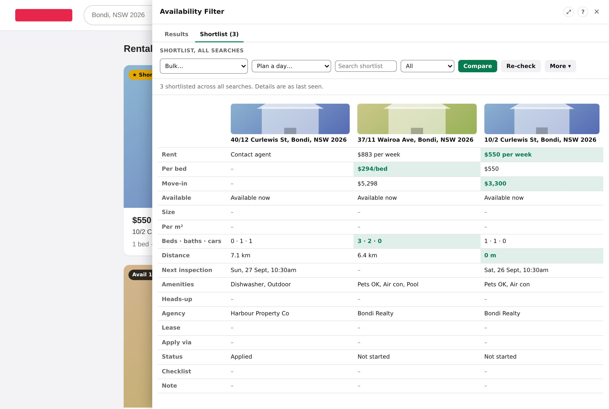

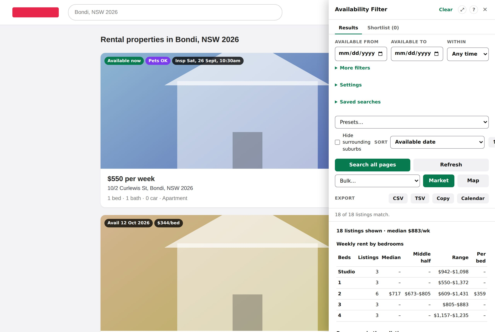

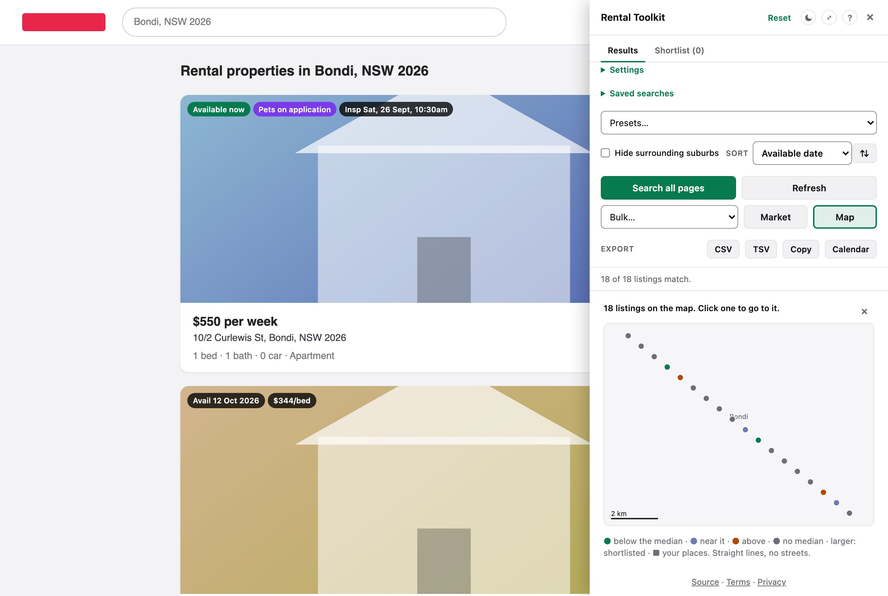

**Export**: CSV (opens cleanly in Excel), TSV, copy to clipboard for Google Sheets, or **Calendar** (.ics) with every upcoming inspection time for your results or shortlist (with an optional reminder, set in Settings; one listing's times from its ⋯ menu). The whole-list export also adds all-day reminders to follow up applications with no answer, for application deadlines, for your own lease end, and for the last day to give notice (enter your notice period in Settings; it depends on your state and lease). Reminders you no longer need (you applied, heard back, or the listing went) come out when you import the file again, and with a calendar reminder set the all-day ones alert at 9am the day before. Spreadsheet columns include weekly rent, $/bed, move-in cost, cash to move (move-in plus any lease overlap), apply-by date, vs-median, inspections, shortlist, application status and date, checklist results, lease term, apply-via, lease fit, taken and previous price.

**Dark mode** follows your system, or pick Light or Dark under Settings → Theme. **Mobile width** follows the screen. Keyboard and screen-reader friendly (labelled controls, focus kept where you were, full-screen drawer is modal on phones).

<p>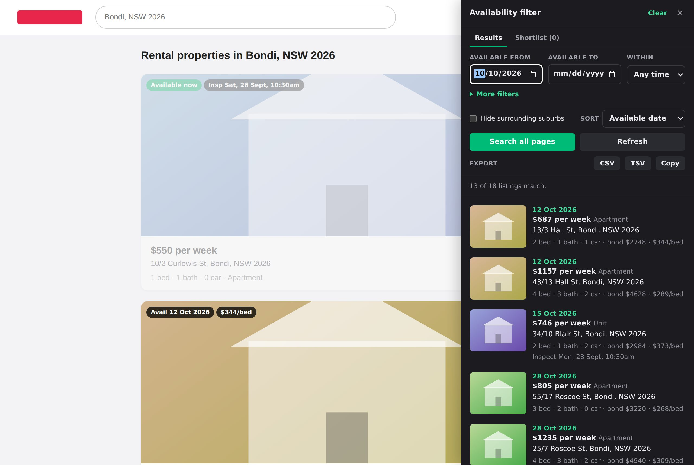 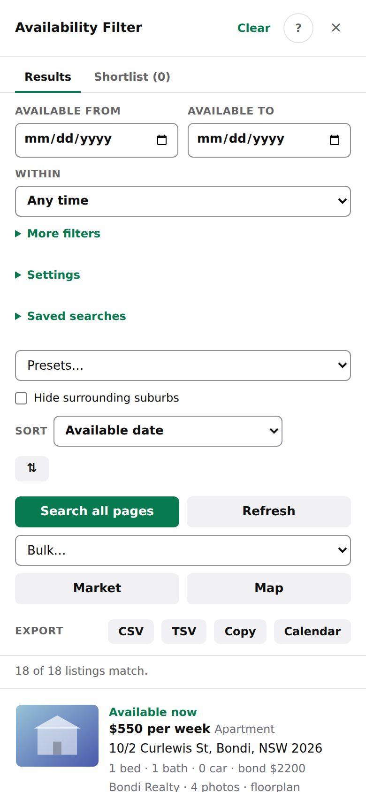</p>

## How it behaves

- **Polite to REA**: pages are fetched one at a time with a jittered ~600ms gap. 429/5xx responses back off exponentially (honouring `Retry-After`, capped at 60s) and requests time out after 20s. If REA answers with a bot check (403, repeated 429s, or a challenge page), all fetching pauses for 10 minutes in that tab. The page you're already on is reused rather than refetched, and results are cached per tab for 10 minutes. **Refresh** forces a refetch.
- **SPA-aware**: changing the search cancels an in-flight crawl. Paging within a search keeps the cache.
- **Non-invasive**: REA's DOM is only touched append-only (one badge per result card plus `data-rf-*` attributes), so React re-renders can't break it or be broken by it.
- **Storage**: settings, shortlist, notes and seen-listing history live in `localStorage` on realestate.com.au (listings not seen for 90 days are forgotten unless shortlisted, hidden or noted). Remembered results for your last three searches are in `localStorage` too (a very large search keeps less text for the listings furthest down, so it fits); this tab's working results are in `sessionStorage`. Settings shows how much is stored, and **Delete all my data** removes only this script's keys.

## When REA changes something

REA's data format is undocumented and changes. If the badges on REA's cards stop appearing, the drawer shows a banner saying the cards weren't recognised. The script tries several likely field names, then searches the listing by shape, and degrades to blank rather than breaking. It also remembers how often each field is usually present and warns if one suddenly disappears. If you see that warning, press **Copy report** in it (also under Settings) and paste the result into an issue: it holds the diagnostics and one listing's structure, with no listing text, names or addresses. If a field is always empty but there's no warning, click **Search all pages**, then open DevTools and run:

```js
reaFilter.selfcheck() // copies a diagnostics report (fields found, usual rates, recent errors) - paste it into the issue
reaFilter.probe()     // every field path the script reads, and whether it exists (plus discovered paths)
reaFilter.shape()     // one listing's structure with names, addresses and descriptions taken out - safe to paste
reaFilter.raw()       // one raw listing object (includes the listing's text)
```

Then [open an issue](../../issues/new?template=rea-format-changed.md) with the output.

## Development

No dependencies; Node 20+.

```sh
npm run lint    # syntax + project invariants (header, privacy, storage keys, changelog)
npm run check   # lint + unit tests (what CI runs first)
npm run e2e:setup  # once: the Playwright version CI pins, plus Chromium
npm run e2e     # Chromium tests against fixture pages on the REA origin
npm run live    # local only: one real search, core paths, saves a fresh shape to test/shapes/
npm run coverage   # unit + e2e line coverage
node test/e2e/screenshots.js   # regenerate docs/screenshots
```

More docs:

- [CONTRIBUTING.md](CONTRIBUTING.md): setup, tests, CI, rules of thumb.
- [docs/ARCHITECTURE.md](docs/ARCHITECTURE.md): how the script works, what it stores, and which versions to bump.
- [docs/ROADMAP.md](docs/ROADMAP.md): current status, decisions taken, known limitations, ideas not built yet, and the release checklist.
- [CHANGELOG.md](CHANGELOG.md): every release.
- [PRIVACY.md](PRIVACY.md): what is stored, where, and what leaves your browser.
- [SECURITY.md](SECURITY.md): reporting a vulnerability privately, and what the script treats as untrusted.

See [CONTRIBUTING.md](CONTRIBUTING.md) for layout, rules of thumb and the CI pipeline (which can also be run on demand from the Actions tab, eg to repeat the browser tests or regenerate screenshots). Screenshots use generated fixture data, not real listings.

## Disclaimer

Not affiliated with, endorsed by or supported by REA Group. It reads pages you can already see, in your own browser, at human-ish speed. Use it in line with [realestate.com.au](https://www.realestate.com.au/)'s terms. Listing data belongs to REA and its agents.

## Licence

[MIT](LICENSE)
